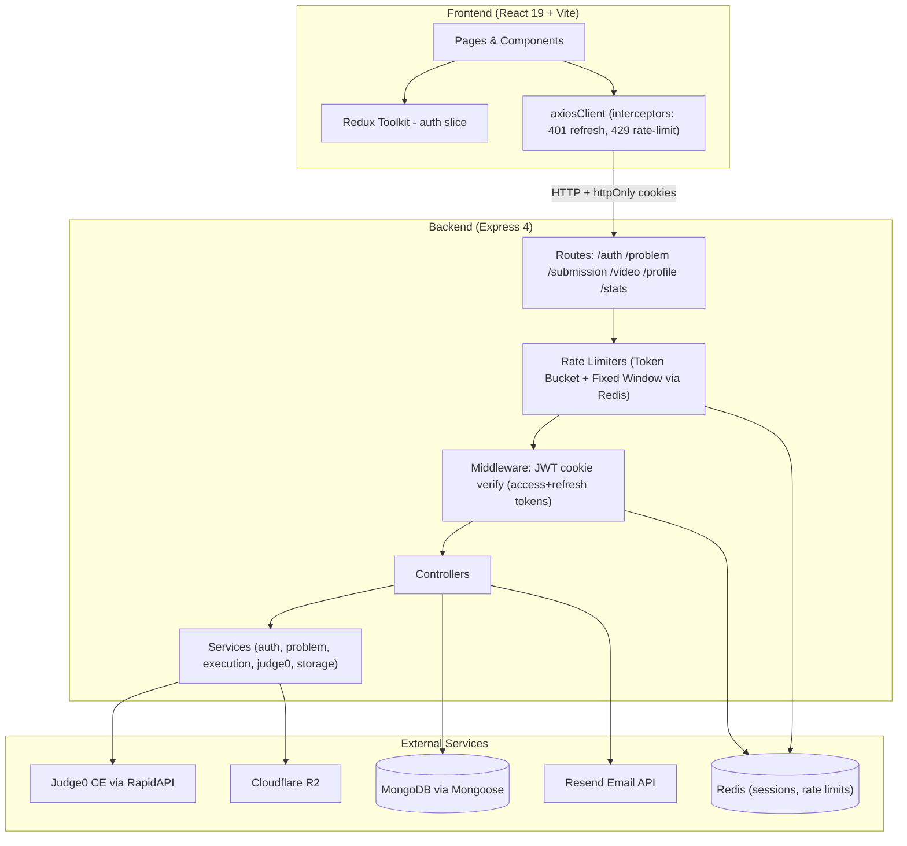

# System Architecture

**Project:** CodeArena coding platform  
**Repository layout:** `coding-platform/` (monorepo-style split: `frontend/` + `backend/`)  
**Last reviewed:** 2026-05-29

## Overview

CodeArena is a LeetCode-style web application where users register, verify their email, browse DSA problems with server-side search/filter/pagination, write code in a Monaco editor, run against visible test cases, submit against hidden test cases (via Judge0), and track solved problems. Admins create/update/delete problems (uploading hidden test cases to Cloudflare R2) and link editorial videos via YouTube URLs.

There is **no WebSocket or realtime layer** in the current codebase.

## High-Level Diagram

## Technology Stack

| Layer | Technology |
|-------|------------|
| Frontend | React 19, Vite, React Router 7, Redux Toolkit, Tailwind CSS + DaisyUI, Monaco Editor, react-hook-form + Zod, NProgress, react-hot-toast |
| Backend | Node.js, Express 4, Mongoose, JWT (dual access+refresh cookies), bcrypt, Redis, rate-limiter-flexible, Resend (email) |
| Code execution | Judge0 CE (RapidAPI) with base64 encoding |
| Media/Storage | YouTube (video links), Cloudflare R2 (hidden testcases) |
| Database | MongoDB (Atlas or local) |
| Caching/Sessions | Redis (refresh token sessions, rate limiter state, token bucket counters) |

## Feature Boundaries

| Feature | Frontend | Backend | Data |
|---------|----------|---------|------|
| Auth | `authSlice`, Login/Signup, Verify/Check Email | `/auth/*`, dual JWT, refresh rotation, Resend email | `user` collection, Redis sessions |
| Profile & Stats | `Profile`, `EditProfile`, `axiosClient` | `/profile/*`, `/stats` | `user` collection, `Submission` aggregations |
| Problem catalog | `Homepage` with server-side search/filter/pagination | `/problem/getProblems`, `listProblems` service | `Problem`, `Submission` (for isSolved) |
| Problem solve | `ProblemPage` + problem components + `useRateLimit` hook | `/submission/run/:id`, `/submission/submit/:id` | `Problem`, `Submission` |
| Submissions history | `SubmissionHistory` | `/problem/problemSubmmision/:id` | `Submission` |
| Admin CRUD | Admin* components with pagination | `/problem/create\|update\|delete`, admin routes with rate limiting | `Problem` (w/ R2 keys), `Counter`, `ReusableProblemNo` |
| Editorial video | `Editorial`, `UploadVideoSolution`, `ManageVideoSolutions` | `/video/*` + YouTube integration | `SolutionVideo` |
| Rate limiting | `useRateLimit` hook, cooldown UI on run/submit/login/register | `rateLimitMiddleware` (Token Bucket for run/submit, Fixed Window for login/register) | Redis keys |

## Configuration & Environment

Backend `.env` (not committed):

| Variable | Purpose |
|----------|---------|
| `PORT` | Express server port (typically 3000) |
| `DB_CONNECT_STRING` | MongoDB connection string |
| `JWT_KEY` | Access token signing secret |
| `JWT_REFRESH_KEY` | Refresh token signing secret |
| `REDIS_URL` | Redis connection URL |
| `RAPID_API_KEY` | Judge0 CE RapidAPI key |
| `R2_ENDPOINT` | Cloudflare R2 endpoint URL |
| `R2_ACCESS_KEY_ID` | Cloudflare R2 access key |
| `R2_SECRET_ACCESS_KEY` | Cloudflare R2 secret key |
| `R2_BUCKET_NAME` | Cloudflare R2 bucket name |
| `RESEND_API_KEY` | Resend email API key |
| `FRONTEND_URL` | Frontend URL for password reset emails |

Frontend hardcodes API base URL: `http://localhost:3000` in `axiosClient.js`.  
CORS on backend allows `http://localhost:5173` and `http://localhost:5174`.

## Authentication Model (Current)

**Dual token system** with httpOnly cookies:

- **Access token** (`accessToken` cookie) — 15-minute expiry, verified by `userMiddleware`
- **Refresh token** (`refreshToken` cookie) — 7-day expiry, stored hashed in Redis, rotated on each refresh
- **Silent refresh** — Frontend axios interceptor automatically calls `POST /user/refresh` on 401, retries original request
- **`userMiddleware`** — Verifies access token JWT, loads user from DB, attaches `req.user`
- **`adminMiddleware`** — Authorization only; requires `userMiddleware` first; checks `req.user.role === "admin"` → `403`
- **Rate limiting** — Login/register limited by IP (Fixed Window), run/submit limited by userId (Token Bucket with Lua script)

See [AUTH_FLOW.md](./AUTH_FLOW.md).

## Known Architectural Risks

1. **JWT role staleness:** Token payload role does not update if DB role changes until re-login.
2. **Judge0 dependency:** All run/submit/create/update paths depend on external API availability.
3. **Tag enum duplication:** `VALID_TAGS` in `models/problem.js` duplicated in frontend `Homepage.jsx` `tagOptions`.
4. **Language ID duplication:** `constants/judge0.js` language IDs and frontend hardcoded `javascript|java|cpp`.
5. **Cookie security:** `httpOnly` + `sameSite: "strict"` but no `secure` flag (HTTP-only local dev).
6. **`submission` schema** does not define `errorMessage` field; controller assigns it (Mongoose strict mode may strip it).

## Changelog

### 2026-05-29 — Full documentation sync

- Dual JWT (access + refresh) token system with Redis-backed sessions and rotation
- Rate limiting: Token Bucket (Lua) for run/submit, Fixed Window for login/register/change-password
- Password reset flow: forgot → email (Resend) → reset token → change
- Server-side search, filter, pagination with `buildProblemQuery` + `listProblems` service
- Problem numbering with `Counter` + `ReusableProblemNo` models
- Base64 encoding/decoding for Judge0 submissions
- Frontend: custom dropdowns, skeleton loaders, `useRateLimit` hook, `useDebounce`, NProgress
- CORS multi-origin support
- Axios interceptor: 429 rate-limit forwarding + silent 401 token refresh

### 2026-05-18 — Authentication improved (`d3cfb37`)

- Fixed `userMiddleware` to authenticate any user; `req.result` renamed to `req.user`.
- Problem schema: required `inputFormat`, `outputFormat`, `constraints`.

## Related Documentation

- [API_FLOW.md](./API_FLOW.md)
- [AUTH_FLOW.md](./AUTH_FLOW.md)
- [FRONTEND_FLOW.md](./FRONTEND_FLOW.md)
- [BACKEND_FLOW.md](./BACKEND_FLOW.md)
- [DATABASE_FLOW.md](./DATABASE_FLOW.md)
- [DEPENDENCY_GRAPH.md](./DEPENDENCY_GRAPH.md)
- [GETTING_STARTED.md](./GETTING_STARTED.md)
- [DOC_INDEX.md](./DOC_INDEX.md)