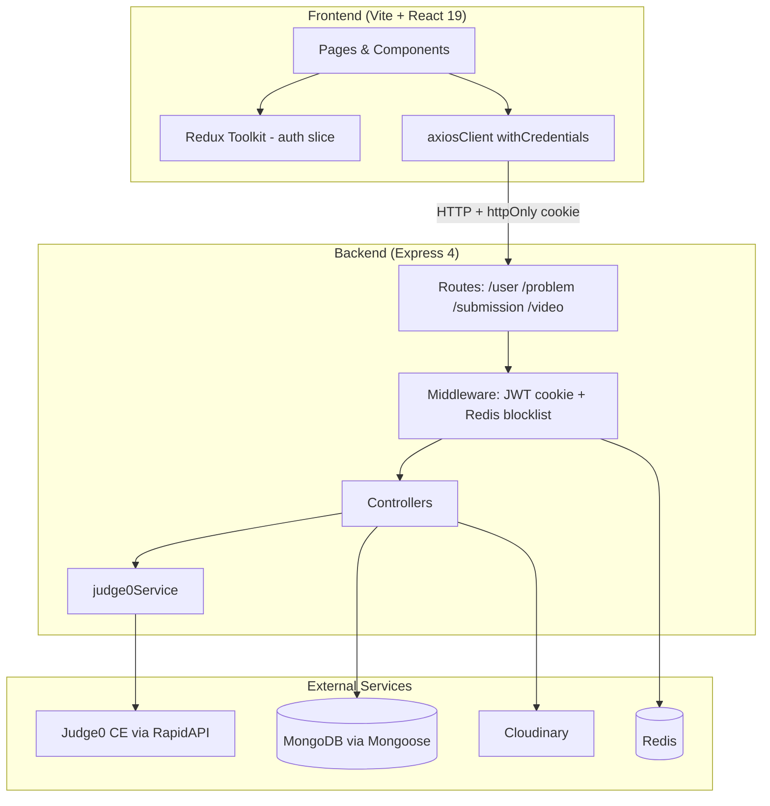

# System Architecture

**Project:** CodeArena / LeetLab coding platform  
**Repository layout:** `coding-platform/` (monorepo-style split: `frontend/` + `backend/`)  
**Last reviewed:** 2026-05-18

## Overview

CodeArena is a LeetCode-style web application where users register, browse DSA problems, write code in a Monaco editor, run against visible test cases, submit against hidden test cases (via Judge0), and track solved problems. Admins create/update/delete problems and upload editorial videos to Cloudinary.

There is **no WebSocket or realtime layer** in the current codebase (verified by search).

## High-Level Diagram

## Technology Stack

| Layer | Technology |
|-------|------------|
| Frontend | React 19, Vite 8, React Router 7, Redux Toolkit, Tailwind + DaisyUI, Monaco Editor, react-hook-form + Zod |
| Backend | Node.js, Express, Mongoose 9, JWT (cookie), bcrypt, Redis 5 |
| Code execution | Judge0 CE (RapidAPI) |
| Media | Cloudinary (signed direct upload from browser) |
| Database | MongoDB |

## Feature Boundaries

| Feature | Frontend | Backend | Data |
|---------|----------|---------|------|
| Auth | `authSlice`, Login/Signup | `/user/*` | `user` collection, Redis token blocklist |
| Problem catalog | `Homepage` | `/problem/getAllProblems`, filters client-side | `Problem` |
| Problem solve | `ProblemPage` + problem components | `/problem/problemById`, `/submission/*` | `Problem`, `submission` |
| Submissions history | `SubmissionHistory` | `/problem/problemSubmmision/:id` | `submission` |
| Admin CRUD | Admin* components | `/problem/create|update|delete`, admin routes | `Problem` |
| Editorial video | `Editorial`, `AdminUpload` | `/video/*` + Cloudinary | `solutionVideo` |

## Configuration & Environment (uncertain values)

No `.env` files are committed. Backend expects (from code references):

- `PORT`, `DB_CONNECT_STRING`, `JWT_KEY`, `REDIS_URL`
- `RAPID_API_KEY` (Judge0)
- `CLOUDINARY_CLOUD_NAME`, `CLOUDINARY_API_KEY`, `CLOUDINARY_API_SECRET`

Frontend hardcodes API base URL: `http://localhost:3000` in `axiosClient.js`.  
CORS on backend allows `http://localhost:5173` only.

## Authentication model (current)

- **`userMiddleware`** — JWT cookie verify, Redis blocklist, `User.findById`, attaches **`req.user`** (full Mongoose document).
- **`adminMiddleware`** — authorization only; requires `userMiddleware` first; checks `req.user.role === "admin"` → `403` if not.
- Admin routes use **`userMiddleware, adminMiddleware`** (not `adminMiddleware` alone).

See [AUTH_FLOW.md](./AUTH_FLOW.md).

## Known Architectural Risks

1. **Route vs UI auth mismatch:** `/problem/:problemId` is not gated in `App.jsx`, but APIs require authentication.
2. **JWT role staleness:** Token payload role does not update if DB role changes until re-login.
3. **Judge0 status field inconsistency:** `problemsControllers` uses `status_id`; `userSubmission` uses `status.id`.
4. **Unused dependencies:** `helmet`, `morgan`, `rate-limiter-flexible` listed in `package.json` but not wired in `index.js`.
5. **`submission` schema** has no `errorMessage` field; controller assigns it anyway (may be stripped by Mongoose strict mode).

## Changelog

### 2026-05-18 — Authentication improved (`d3cfb37`)

- Fixed `userMiddleware` to authenticate any user; `req.result` renamed to **`req.user`** across controllers.
- `adminMiddleware` simplified to role check only (depends on `userMiddleware`).
- Admin routes now chain `userMiddleware` + `adminMiddleware`.
- JWT cookie expiry **1 day** (`expiresIn: "1d"`).
- Problem schema: required **`inputFormat`**, **`outputFormat`**, **`constraints`**; exposed in GET problem APIs and admin forms/UI.

## Related Documentation

- [API_FLOW.md](./API_FLOW.md)
- [AUTH_FLOW.md](./AUTH_FLOW.md)
- [FRONTEND_FLOW.md](./FRONTEND_FLOW.md)
- [BACKEND_FLOW.md](./BACKEND_FLOW.md)
- [DATABASE_FLOW.md](./DATABASE_FLOW.md)
- [DEPENDENCY_GRAPH.md](./DEPENDENCY_GRAPH.md)
- [GETTING_STARTED.md](./GETTING_STARTED.md)
- [DOC_INDEX.md](./DOC_INDEX.md)