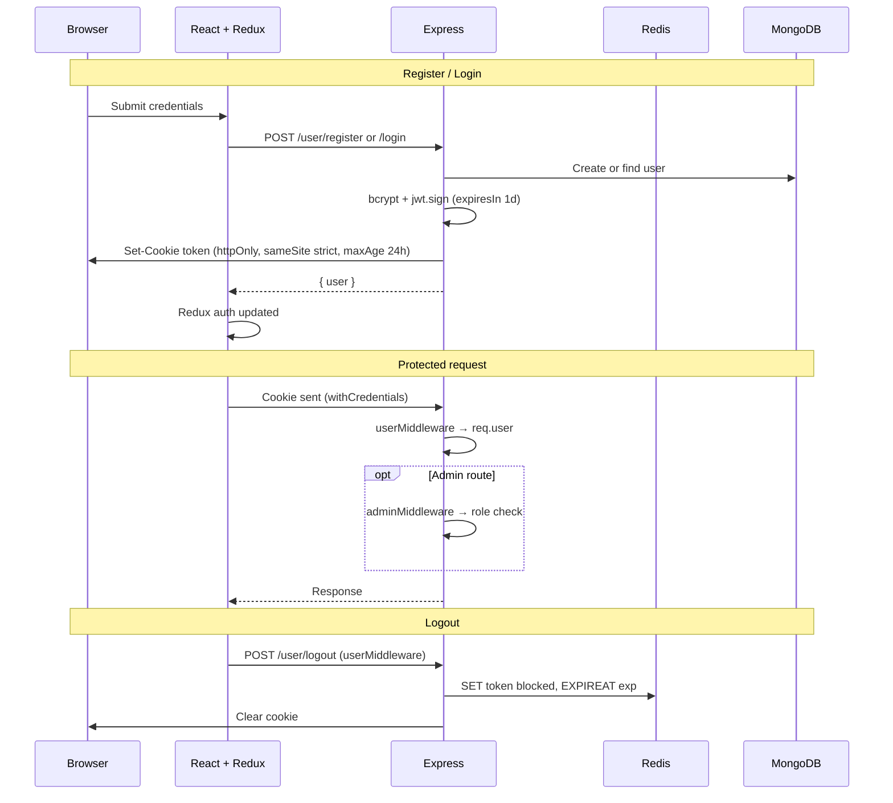

# Authentication Flow

**Mechanism:** JWT in httpOnly cookie `token` · Redis logout blocklist · `req.user` on authenticated requests  
**Last reviewed:** 2026-05-18 (synced with `authentication improved` / `d3cfb37`)

## Mechanism

- JWT stored in **httpOnly** cookie named `token`
- **Redis** key `token:<jwt>` → `"blocked"` until JWT `exp` on logout
- **MongoDB** user loaded after verify → attached as **`req.user`** (Mongoose document)
- **Authorization** split: `userMiddleware` (auth) + `adminMiddleware` (admin role only)

## Middleware

### userMiddleware

| Step | Behavior |
|------|----------|
| 1 | Missing cookie → `401 Unauthorized Access` |
| 2 | `jwt.verify(token, JWT_KEY)` — throws if invalid/expired |
| 3 | Missing `payload.id` → `401 Invalid Token` |
| 4 | `User.findById(id)` — missing → `401 User Doesn't Exist` |
| 5 | Redis `exists token:<token>` → `401 Invalid Token` |
| 6 | `req.user = user`; `next()` |

### adminMiddleware

Requires **`userMiddleware` first**.

| Check | Response |
|-------|----------|
| `req.user.role !== "admin"` | `403 Access Denied` |
| else | `next()` |

Does **not** re-verify JWT or query Redis.

## Sequence Diagram

## JWT Payload

| Field | Source |
|-------|--------|
| `id` | User `_id` |
| `emailId` | User email |
| `role` | `user.role` from DB at sign time |

**Expiry:** `expiresIn: "1d"` · cookie `maxAge: 24 * 60 * 60 * 1000`

### Register vs login

- **Register:** `req.body.role = "user"` before create; JWT uses `role: user.role` (always `"user"`).
- **Login:** JWT uses actual DB `user.role` (user or admin).

If DB role changes later, existing JWT still holds old role until re-login.

## Route middleware matrix

| Route pattern | Middleware |
|---------------|------------|
| `POST /user/register`, `/login` | — |
| `POST /user/logout`, `GET /user/check`, `DELETE /user/profile` | `userMiddleware` |
| `POST /user/admin/Register` | `userMiddleware`, `adminMiddleware` |
| `POST /problem/create`, PUT/DELETE admin, `/video/*` admin | `userMiddleware`, `adminMiddleware` |
| User problem reads, `/submission/*` | `userMiddleware` |

## Frontend

- **Slice:** `frontend/src/authSlice.js` — thunks: `registerUser`, `loginUser`, `checkAuth`, `logoutUser`
- **Bootstrap:** `App.jsx` → `dispatch(checkAuth())` → `GET /user/check`
- **Guards:** `/` authenticated; `/admin/*` needs `user.role === "admin"` (case-sensitive in `App.jsx`)
- **`/problem/:id`:** no UI guard; backend still requires cookie

## Admin bootstrap

`POST /user/admin/Register` — existing admin session required. No frontend UI.

## Security notes

- Cookie: `httpOnly`, `sameSite: "strict"`; no `secure` flag (local HTTP)
- Register validation: `validator.isStrongPassword` in `utils/validate.js`
- Auth errors thrown as `Error` may surface as **500** via `errorMiddleware` (not dedicated 401 handler)

## Related

- [backend_docs/middleware/userMiddleware.md](../backend_docs/middleware/userMiddleware.md)
- [backend_docs/middleware/adminMiddleware.md](../backend_docs/middleware/adminMiddleware.md)
- [backend_docs/auth/userAuthenticate.md](../backend_docs/auth/userAuthenticate.md)
- [frontend_docs/state/authSlice.md](../frontend_docs/state/authSlice.md)

## Common risks / notes

- Never mount `adminMiddleware` without preceding `userMiddleware`.
- Redis required for logout blocklist checks on every authenticated request.
- Longer JWT window (1d) increases exposure if cookie is compromised.
