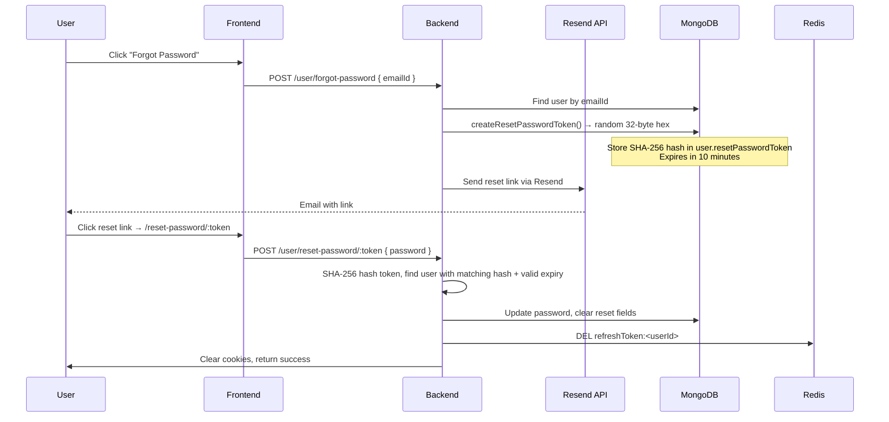

# Authentication Flow

**Mechanism:** Dual JWT (access + refresh) in httpOnly cookies · Redis refresh-session store · Token rotation · Rate limiting  
**Last reviewed:** 2026-05-29

## Mechanism

- **Access token** stored in httpOnly cookie `accessToken` — 15-minute expiry
- **Refresh token** stored in httpOnly cookie `refreshToken` — 7-day expiry
- Refresh token **hashed** (SHA-256) before storing in Redis key `refreshToken:<userId>`
- **Token rotation:** On refresh, old refresh token is invalidated and new pair issued
- **MongoDB** user loaded after access token verify → attached as `req.user` (Mongoose document)
- **Authorization** split: `userMiddleware` (auth) + `adminMiddleware` (admin role only)
- **Rate limiting** via `rateLimitMiddleware`: Fixed Window for login/register/change-password, Token Bucket for run/submit

## Token Configuration

| Token | Expiry (JWT) | Cookie maxAge | Secret |
|-------|-------------|---------------|--------|
| Access | `15m` | 15 minutes | `JWT_KEY` |
| Refresh | `7d` | 7 days | `JWT_REFRESH_KEY` |

Cookie options (`utils/auth/cookieOptions.js`):
- `httpOnly: true` — not accessible via JavaScript
- `sameSite: "strict"` — CSRF protection
- No `secure` flag (HTTP-only local development)

## Middleware

### userMiddleware

| Step | Behavior |
|------|----------|
| 1 | Missing `accessToken` cookie → `401 Unauthorized access` |
| 2 | `jwt.verify(accessToken, JWT_KEY)` — throws if invalid/expired |
| 3 | Missing `payload.id` → `401 Invalid token` |
| 4 | `User.findById(id)` — missing → `401 User does not exist` |
| 5 | `req.user = user`; `next()` |

> **Note:** Unlike the previous version, the current `userMiddleware` does NOT check a Redis blocklist. Logout invalidation is handled by deleting the refresh session from Redis and clearing cookies.

### adminMiddleware

Requires **`userMiddleware` first**.

| Check | Response |
|-------|----------|
| `req.user.role !== "admin"` | `403 Access denied` |
| else | `next()` |

### rateLimitMiddleware

| Limiter | Strategy | Key | Limit | Window |
|---------|----------|-----|-------|--------|
| `limitLogin` | Fixed Window (RateLimiterRedis) | IP address | 10 attempts | 15 minutes |
| `limitRegister` | Fixed Window (RateLimiterRedis) | IP address | 5 attempts | 1 hour |
| `limitChangePassword` | Fixed Window (RateLimiterRedis) | User ID | 5 attempts | 15 minutes |
| `limitRunCode` | Token Bucket (Redis Lua) | User ID | 3 burst, 1 per 15s refill | Continuous |
| `limitSubmitCode` | Token Bucket (Redis Lua) | User ID | 3 burst, 1 per 30s refill | Continuous |

All limiters **fail-open** on Redis errors (log and call `next()`).

Rate-limit headers: `X-RateLimit-Limit`, `X-RateLimit-Remaining`, `Retry-After` (on 429).

## Sequence Diagram

```mermaid
sequenceDiagram
  participant Browser
  participant FE as React + Redux
  participant API as Express
  participant Redis
  participant DB as MongoDB

  Note over Browser,DB: Register / Login
  Browser->>FE: Submit credentials
  FE->>API: POST /user/register or /login
  API->>DB: Create or find user + bcrypt verify
  API->>API: generateTokens(user) → access + refresh JWTs
  API->>Redis: SET refreshToken:<userId> = hash(refreshToken), EX 7d
  API->>Browser: Set-Cookie accessToken (15m) + refreshToken (7d)
  API-->>FE: { user }
  FE->>FE: Redux auth.fulfilled

  Note over Browser,DB: Protected request (access token valid)
  FE->>API: Cookie sent (withCredentials)
  API->>API: userMiddleware → verify accessToken → req.user
  opt Admin route
    API->>API: adminMiddleware → role check
  end
  API-->>FE: Response

  Note over Browser,DB: Access token expired (silent refresh)
  FE->>API: Request fails 401
  FE->>FE: Axios interceptor catches 401
  FE->>API: POST /user/refresh (refreshToken cookie)
  API->>API: verifyRefreshToken(refreshToken)
  API->>Redis: GET refreshToken:<userId> → compare hashes
  API->>Redis: DEL old, SET new hashed refresh token
  API->>Browser: Set-Cookie new accessToken + new refreshToken
  FE->>API: Retry original request with new cookies
  API-->>FE: Success

  Note over Browser,DB: Logout
  FE->>API: POST /user/logout (userMiddleware)
  API->>Redis: DEL refreshToken:<userId>
  API->>Browser: Clear accessToken + refreshToken cookies
```

## JWT Payload

| Field | Source |
|-------|--------|
| `id` | User `_id` |
| `emailId` | User email |
| `role` | `user.role` from DB at sign time |

### Register vs login

- **Register:** role set to `"user"` (or `"admin"` via `/admin/Register`)
- **Login:** JWT uses actual DB `user.role`

If DB role changes later, existing JWT still holds old role until re-login.

## Password Reset Flow

## Route Middleware Matrix

| Route pattern | Middleware chain |
|---------------|-----------------|
| `POST /user/register` | `limitRegister` → `register` |
| `POST /user/login` | `limitLogin` → `login` |
| `POST /user/logout` | `userMiddleware` → `logout` |
| `POST /user/refresh` | (none) → `refreshAccessToken` |
| `POST /user/forgot-password` | `limitLogin` → `forgotPassword` |
| `POST /user/reset-password/:token` | (none) → `resetPassword` |
| `POST /user/change-password` | `userMiddleware` → `limitChangePassword` → `changePassword` |
| `GET /user/check` | `userMiddleware` → inline JSON |
| `POST /user/admin/Register` | `userMiddleware` → `adminMiddleware` → `adminRegister` |
| `DELETE /user/profile` | `userMiddleware` → `deleteProfile` |
| Problem admin routes | `userMiddleware` → `adminMiddleware` → `limitSubmitCode` (create/update) |
| Problem user reads | `userMiddleware` |
| `POST /submission/run/:id` | `userMiddleware` → `limitRunCode` → `runCode` |
| `POST /submission/submit/:id` | `userMiddleware` → `limitSubmitCode` → `submitCode` |
| `/video/*` admin | `userMiddleware` → `adminMiddleware` |

## Frontend Integration

- **Slice:** `frontend/src/authSlice.js` — thunks: `registerUser`, `loginUser`, `checkAuth`, `logoutUser`
- **Rate limit metadata:** Thunks propagate `error.rateLimitedFor` from axios interceptor for UI cooldown
- **Bootstrap:** `App.jsx` → `dispatch(checkAuth())` → `GET /user/check`
- **Silent refresh:** `axiosClient.js` interceptor catches 401, calls `POST /user/refresh`, retries
- **429 handling:** Interceptor attaches `rateLimitedFor` seconds to error object
- **Guards:**
  - `/` — authenticated only
  - `/login`, `/signup`, `/forgot-password`, `/reset-password/:token` — guest only
  - `/change-password` — authenticated only
  - `/problem/:problemId` — authenticated only
  - `/admin/*` — authenticated + admin role
- **`useRateLimit` hook:** Manages cooldown countdown timer for rate-limited actions

## Admin Bootstrap

`POST /user/admin/Register` — existing admin session required. No frontend UI for this.

## Security Notes

- Cookies: `httpOnly`, `sameSite: "strict"`; no `secure` flag (local HTTP)
- Register validation: `validator.isStrongPassword` in `utils/validate.js`
- Password change validation: `utils/auth/validatePassword.js`
- Refresh tokens hashed with SHA-256 before Redis storage
- Rate limiting on all auth endpoints prevents brute-force
- Reset tokens expire in 10 minutes

## Related

- [backend_docs/middleware/userMiddleware.md](../backend_docs/middleware/userMiddleware.md)
- [backend_docs/middleware/adminMiddleware.md](../backend_docs/middleware/adminMiddleware.md)
- [backend_docs/middleware/rateLimitMiddleware.md](../backend_docs/middleware/rateLimitMiddleware.md)
- [backend_docs/auth/userAuthenticate.md](../backend_docs/auth/userAuthenticate.md)
- [frontend_docs/state/authSlice.md](../frontend_docs/state/authSlice.md)
- [frontend_docs/hooks/useRateLimit.md](../frontend_docs/hooks/useRateLimit.md)
