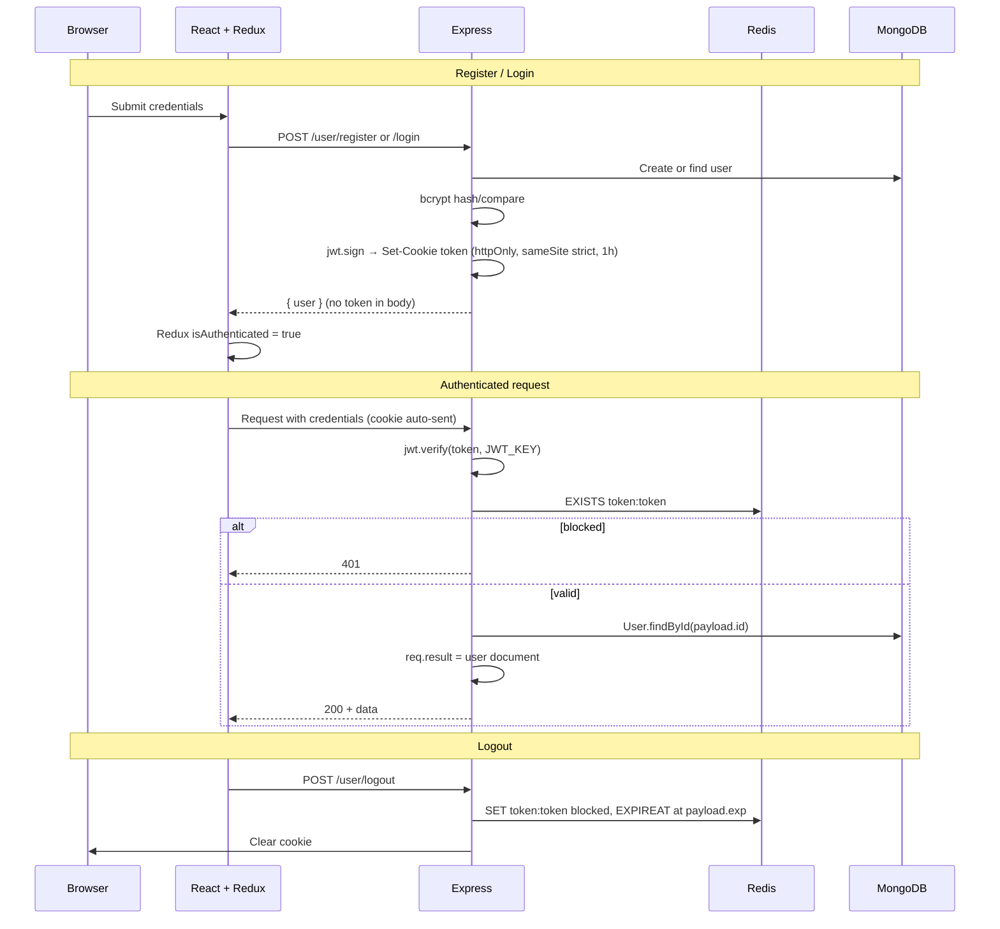

# Authentication Flow

**Mechanism:** JWT stored in **httpOnly** cookie named `token`  
**Logout:** Redis blocklist key `token:<jwt>` until JWT `exp`  
**Last reviewed:** 2026-05-18

## Sequence Diagram

## JWT Payload

| Field | Source |
|-------|--------|
| `id` | User `_id` |
| `emailId` | User email |
| `role` | `"user"` on register (hardcoded in sign); actual `user.role` on login |

**Note:** On register, JWT always sets `role: "user"` in payload even though DB stores role correctly.

## Middleware Roles

| Middleware | File | Checks |
|------------|------|--------|
| `userMiddleware` | `middlewares/userMiddleware.js` | **⚠ See critical issue below** |
| `adminMiddleware` | `middlewares/adminMiddleware.js` | JWT + `payload.role === 'admin'` + DB role + Redis blocklist |

### Critical issue (verified in repo)

`userMiddleware.js` currently contains **admin-only** logic (identical pattern to `adminMiddleware.js`: requires `payload.role === 'admin'`). Routes import this file as `userMiddleware` for:

- `/user/logout`, `/user/check`, `/user/profile`
- All `/problem/*` user reads
- `/submission/*`

**Expected behavior (inferred from route comments):** verify any authenticated user, not only admins.

**Impact if bug is present:** regular users receive `401 Invalid Token-Not an admin` on protected endpoints.

**Uncertainty:** If a different branch exists locally, re-read `userMiddleware.js` before deploying.

## Frontend Auth State

- **Slice:** `frontend/src/authSlice.js` (not in `store/` folder)
- **Thunks:** `registerUser`, `loginUser`, `checkAuth`, `logoutUser`
- **Store:** `store/store.js` → `state.auth`
- **Bootstrap:** `App.jsx` dispatches `checkAuth()` on mount; shows spinner while `loading`

## Route Guards (client-side)

| Route | Guard |
|-------|-------|
| `/` | Requires `isAuthenticated` else → `/signup` |
| `/login`, `/signup` | Redirect to `/` if authenticated |
| `/admin/*` | `isAuthenticated && user.role === 'admin'` |
| `/problem/:id` | **No guard** (API still requires auth cookie) |

## Admin Bootstrap

- `POST /user/admin/Register` — requires existing admin session (`adminMiddleware`)
- No UI route found for admin registration in frontend (API-only)

## Security Notes

- Cookie: `httpOnly`, `sameSite: 'strict'` — good for XSS; no `secure` flag (OK for local HTTP)
- CORS: single origin `http://localhost:5173`, `credentials: true`
- Password validation on register: `validator.isStrongPassword` in `utils/validate.js`
- Logout blocklist prevents reuse until token expiry

## Related

- [backend_docs/auth/userAuthenticate.md](../backend_docs/auth/userAuthenticate.md)
- [backend_docs/middleware/userMiddleware.md](../backend_docs/middleware/userMiddleware.md)
- [frontend_docs/state/authSlice.md](../frontend_docs/state/authSlice.md)
