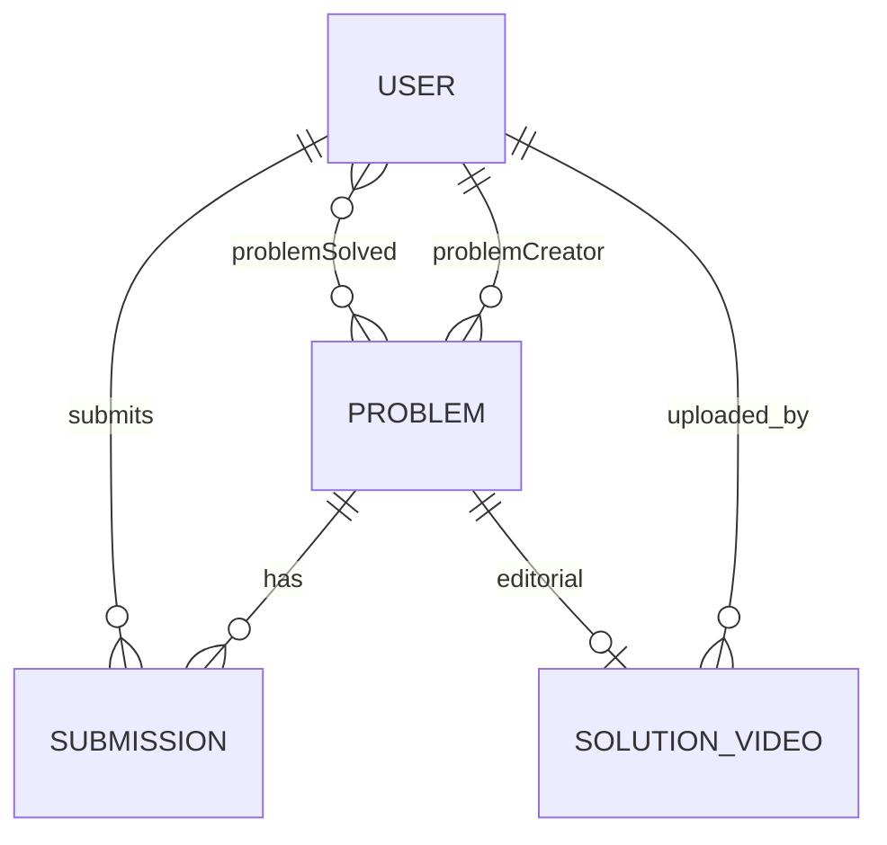

# Database Flow

**ODM:** Mongoose 9  
**Connection:** `process.env.DB_CONNECT_STRING` via `config/db.js`  
**Last reviewed:** 2026-05-18

## Collections (Models)

| Model | Collection name | File |
|-------|-----------------|------|
| User | `users` (default pluralization: `user` model → collection `users`) | `models/user.js` |
| Problem | `problems` | `models/problems.js` |
| Submission | `submissions` | `models/submission.js` |
| SolutionVideo | `solutionvideos` | `models/solutionVideo.js` |

> Mongoose model names: `"user"`, `"Problem"`, `"submission"`, `"solutionVideo"`.

## Entity Relationships

## User Schema Highlights

- `emailId`: unique, indexed, immutable, validated email
- `role`: `user` | `admin`
- `problemSolved`: array of `ObjectId` ref `Problem`
- `password`: bcrypt hash (required)
- **Hook:** `post('findOneAndDelete')` deletes all submissions for that user

## Problem Schema Highlights

- `description`: problem statement (required)
- `inputFormat`, `outputFormat`, `constraints`: required strings (shown in UI and returned by `getProblemById` / admin GET)
- `visibleTestCases`: input, output, explanation
- `hiddenTestCases`: input, output (no explanation)
- `startCode[]`: per-language starter templates
- `referenceSolution[]`: validated via Judge0 on admin create/update
- `tags`: fixed enum list (array)
- `problemCreator`: ref User (set from `req.user._id` on create)

## Submission Schema Highlights

- Indexed compound: `{ userId: 1, problemId: 1 }`
- `status`: pending | accepted | wrong | error
- `language`: cpp | java | javascript
- **Note:** Controller sets `errorMessage` but schema does not define it (may not persist)

## SolutionVideo Schema

- Links `problemId` + `userId` + Cloudinary `cloudinaryPublicId`, `secureUrl`, `thumbnailUrl`, `duration`
- One video per problem in delete flow (`findOneAndDelete({ problemId })`)

## Redis (non-Mongo but auth-related)

- Key: `token:<jwt_string>` → `"blocked"` on logout
- TTL: `expireAt` at JWT `exp` timestamp

## Typical Query Paths

| Operation | Query |
|-----------|-------|
| Login | `User.findOne({ emailId })` |
| List problems | `Problem.find().select(...).skip().limit()` |
| Get problem | `Problem.findById(id).select(...)` + optional `SolutionVideo.findOne({ problemId })` |
| Submissions | `Submission.find({ userId, problemId })` |
| Mark solved | `User.updateOne({ $addToSet: { problemSolved: problemId } })` |
| Solved list | `User.findById(id).populate('problemSolved')` |

## Seeding

`seedProblems.js` inserts predefined problems with a **hardcoded** `ADMIN_USER_ID` — must exist in DB before seeding.

## Related

- [backend_docs/database/](../backend_docs/database/)
