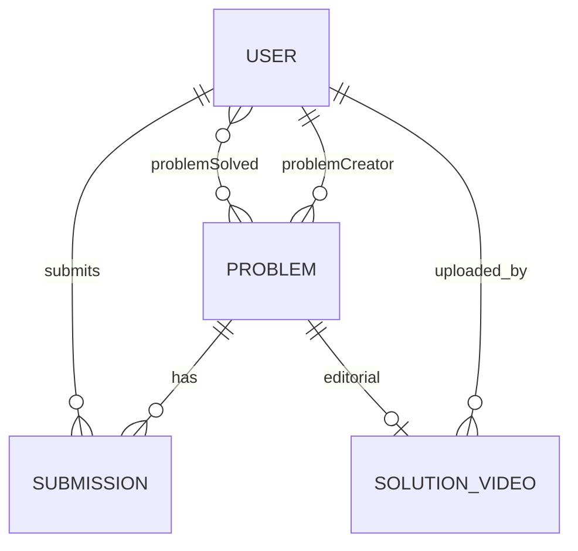

# Database Flow

**ODM:** Mongoose 9  
**Connection:** `process.env.DB_CONNECT_STRING` via `config/db.js`  
**Cache/KV:** Redis via `config/redis.js`  
**Last reviewed:** 2026-05-29

## Collections (Models)

| Model | Collection name | File |
|-------|-----------------|------|
| User | `users` | `models/user.js` |
| Problem | `problems` | `models/problem.js` |
| Submission | `submissions` | `models/submission.js` |
| SolutionVideo | `solutionvideos` | `models/solutionVideo.js` |
| Counter | `counters` | `models/counter.js` |
| ReusableProblemNo | `reusableproblemnoes` | `models/reusableProblemNo.js` |

## Entity Relationships

## User Schema Highlights

- `emailId`: unique, indexed, immutable, validated email
- `username`: unique, trimmed, 3–20 chars, alphanumeric + underscores
- `role`: `user` | `admin`
- `problemSolved`: array of `ObjectId` ref `Problem`
- `password`: bcrypt hash (hashed via `pre('save')` hook)
- `resetPasswordToken` / `resetPasswordExpires`: Used for password reset flow (hashed tokens)
- `isVerified`: Boolean, default `false` — gates login access
- `emailVerificationToken` / `emailVerificationTokenExpires`: Used for email verification flow (hashed tokens)
- `bio`: String, trimmed, max 200 chars, default `''`
- `institution`: String, trimmed, max 100 chars, default `''`
- **Hook:** `post('findOneAndDelete')` deletes all submissions for that user

## Problem Schema Highlights

- `problemNo`: Integer identifier, automatically incremented and unique
- `title`: Indexed for text search
- `slug`: Unique slug for URL routing
- `description`, `inputFormat`, `outputFormat`, `constraints`: Rich text / markdown
- `visibleTestCases`: Array of input/output/explanation objects
- `hiddenTestCasesZip.key`: Reference to the Cloudflare R2 object key containing the hidden test cases ZIP file
- `startCode[]`: Starter templates per language
- `referenceSolution[]`: Validated via Judge0 before saving
- `tags`: Validated against `VALID_TAGS` enum array
- `difficulty`: `easy` | `medium` | `hard`
- **Indexes:** 
  - Text index on `title` (`{ title: "text" }`)
  - Compound index on `{ difficulty: 1, tags: 1 }`
  - Sort index on `{ createdAt: -1 }`

## Problem Numbering System

Instead of relying solely on Mongo ObjectIds, problems have human-readable sequential IDs (`problemNo`).
1. **Counter Model:** Stores the highest assigned ID (`{ _id: "problemNo", seq: X }`).
2. **ReusableProblemNo Model:** If a problem is deleted, its `problemNo` is saved here.
3. **`getNextProblemNo` utility:** When a new problem is created, it first checks `ReusableProblemNo` for the smallest available deleted number. If none exist, it atomically increments `Counter`.

## Submission Schema Highlights

- Compound Index: `{ userId: 1, problemId: 1 }`
- Secondary Index: `{ userId: 1, status: 1 }`
- `status`: Enum containing standard execution states (`accepted`, `wrong_answer`, `time_limit_exceeded`, etc.)
- Tracking metrics: `runtime`, `memory`, `testCasesPassed`, `testCasesTotal`

## SolutionVideo Schema

- Links `problemId` + `userId` + `youtubeUrl` (validated standard YouTube URL)

## Redis Data Structures

While MongoDB is the primary database, Redis acts as a critical secondary datastore:

| Key Pattern | Type | Expiry | Purpose |
|-------------|------|--------|---------|
| `refreshToken:<userId>` | String | 7 days | Hashed refresh token to validate sessions |
| `rl:login:<IP>` | Hash | 15m | Rate limit counters for login (Fixed Window) |
| `rl:register:<IP>` | Hash | 1h | Rate limit counters for registration |
| `rl:change-password:<userId>` | Hash | 15m | Rate limit counters for password changes |
| `rl:run:<userId>` | Hash | TTL varies | Token bucket state (`tokens`, `last_refill`) |
| `rl:submit:<userId>` | Hash | TTL varies | Token bucket state (`tokens`, `last_refill`) |

## Complex Queries

### Problem Search/Filter (`services/problem/listingProblems.js`)
Uses `buildProblemQuery.js` to construct complex Mongo queries:
- Text search: `{ $text: { $search: query } }`
- Exact ID search: `{ problemNo: number }`
- Array intersection (tags): `{ tags: { $all: requestedTags } }`
- Difficulty matching: `{ difficulty: value }`
- Excludes solved/unsolved using `$in`/`$nin` with `Submission` aggregate lookups.
- Projections explicitly exclude heavy fields (`hiddenTestCasesZip`, `startCode`, `description`) for performance.

## Related

- [BACKEND_FLOW.md](./BACKEND_FLOW.md)
- [ARCHITECTURE.md](./ARCHITECTURE.md)
